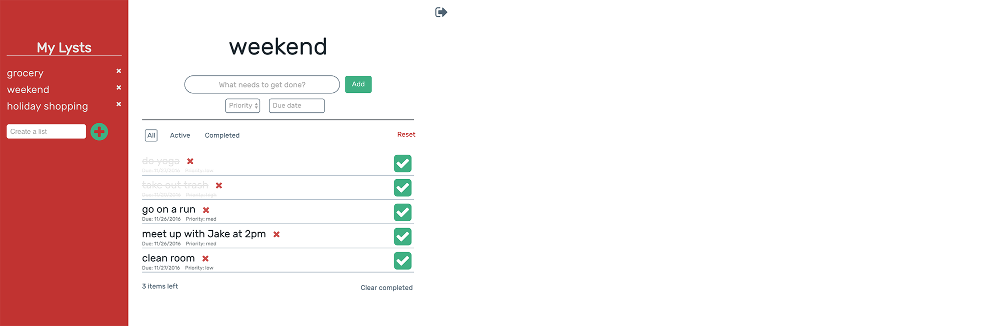

# Lyst
  
## Overview
Lyst is a to do list application built in React and Redux. It allows a user to add an item to a list, mark the item as complete, delete individual items, and delete the entire list.

<a href="http://amituuush.github.io/lyst/public/" target="_blank">Click here</a> for a demo.

## Technical
• The front end of the app is built in React, using LESS as a CSS extension language, and webpack as a module bundler. 
• The back end is currently being built in Node.js with Express, and will use MongoDB with Mongoose as a database. 
• Additionally, Passport will be used to implement user authentication in the app. 
• Travis CI is used for distributed continuous integration.
  

  
## Development Roadmap
Future developments of the app will include: 
• Backend built in Node.js and Express 
• Database built in MongoDB and Mongoose 
• User authentication using Passport 
• Ability to create multiple lists and navigate between lists 
 
